<div align="center">

# CodexProxy

Use the OpenAI Codex CLI (`codex exec`) and any OpenAI Responses client through your own provider-agnostic proxy. CodexProxy is a rebrand of [free-claude-code](https://github.com/Alishahryar1/free-claude-code) that speaks the **OpenAI Responses API** (`POST /v1/responses`) instead of the Anthropic Messages API.

[](https://opensource.org/licenses/MIT)
[](https://www.python.org/downloads/)
[](https://github.com/astral-sh/uv)
[](https://github.com/Alishahryar1/free-claude-code/actions/workflows/tests.yml)
[](https://pypi.org/project/ty/)
[](https://github.com/astral-sh/ruff)
[](https://github.com/Delgan/loguru)

CodexProxy routes OpenAI Responses API traffic from the Codex CLI to any provider. It keeps the Codex CLI's client-side protocol stable while letting you choose free, paid, or local models from the same 17-provider backend catalogue.

[Quick Start](#quick-start) · [Providers](#choose-a-provider) · [Clients](#connect-the-codex-cli) · [Integrations](#optional-integrations) · [Responses API](#responses-api) · [Development](#development)

</div>

## What You Get

- Drop-in proxy for the OpenAI Responses API consumed by the Codex CLI.
- 17 provider backends: NVIDIA NIM, OpenRouter, Google AI Studio (Gemini), DeepSeek, Mistral La Plateforme, Mistral Codestral, OpenCode Zen, OpenCode Go, Wafer, Kimi, Cerebras Inference, Groq, Fireworks AI, Z.ai, LM Studio, llama.cpp, and Ollama.
- Native `codex exec` support: `cdx-codex` writes `~/.codex/config.toml` with `wire_api = "responses"` and the proxy URL so the Codex CLI talks to CodexProxy out of the box.
- Compatible with Claude Code (Anthropic Messages API) for one release as a deprecation shim.
- Streaming, tool use, and provider-specific thinking/reasoning block handling.
- Optional Discord or Telegram bot wrapper for remote coding sessions.
- Optional Usage through the VSCode extension.
- Optional voice-note transcription through local Whisper or NVIDIA NIM.
- Local **Admin UI** at `/admin` to edit supported proxy settings, validate changes, and check providers (loopback access only).

## Star History

<div align="center">
  <a href="https://star-history.com/#Alishahryar1/free-claude-code&Date">
    <picture>
      <source media="(prefers-color-scheme: dark)" srcset="https://api.star-history.com/svg?repos=Alishahryar1/free-claude-code&type=Date&theme=dark">
      <source media="(prefers-color-scheme: light)" srcset="https://api.star-history.com/svg?repos=Alishahryar1/free-claude-code&type=Date">
      
    </picture>
  </a>
</div>

## Quick Start

### 1. Install/Update The Proxy

macOS/Linux:

```bash
curl -fsSL "https://github.com/Alishahryar1/free-claude-code/blob/main/scripts/install.sh?raw=1" | sh
```

Windows PowerShell:

```powershell
irm "https://github.com/Alishahryar1/free-claude-code/blob/main/scripts/install.ps1?raw=1" | iex
```

Review the installers at [scripts/install.sh](https://github.com/Alishahryar1/free-claude-code/blob/main/scripts/install.sh) and [scripts/install.ps1](https://github.com/Alishahryar1/free-claude-code/blob/main/scripts/install.ps1). Re-run these commands to update to the latest version. The installer puts **Codex CLI**, **uv**, **Python 3.14**, and **CodexProxy** on your machine.

### 2. Start The Proxy

```bash
cdx-server
```

After startup, Uvicorn prints the proxy bind address and the app logs the admin URL:

```text
INFO:     Admin UI: http://127.0.0.1:8082/admin (local-only)
```

Many terminals make these clickable. Use your configured `PORT` if it is not `8082`.

### 3. Open The Admin UI And Configure NVIDIA NIM

Open the **Admin UI** URL from the terminal output.

Need an NVIDIA NIM API key? Use the **[NVIDIA NIM provider](#nvidia-nim-provider)** section below, then scroll back up here.

<div align="center">
  
</div>

Paste your NVIDIA NIM API key into `NVIDIA_NIM_API_KEY`, then click **Validate** and **Apply**.

The default model is already set to `nvidia_nim/nvidia/nemotron-3-super-120b-a12b`. You can change it later from the same Admin UI.

### 4. Run Codex

```bash
cdx-codex "Explain this codebase"
```

`cdx-codex` writes `~/.codex/config.toml` with `wire_api = "responses"` and `openai_base_url = http://127.0.0.1:8082/v1`, sets `OPENAI_API_KEY` to the proxy's auth token, and then launches the real `codex exec` command. The Codex CLI talks to CodexProxy for every Responses request.

## Choose A Provider

Pick one provider, enter its key or local URL in the Admin UI, and set `MODEL` to a provider-prefixed model slug. The single `MODEL` setting is the only model CodexProxy advertises on `/v1/models`; tier-based overrides are no longer required.

<a id="nvidia-nim-provider"></a>

### 1. [NVIDIA NIM](https://build.nvidia.com/)

Get a key at [build.nvidia.com/settings/api-keys](https://build.nvidia.com/settings/api-keys).

In the Admin UI, paste it into `NVIDIA_NIM_API_KEY`. The default `MODEL` is `nvidia_nim/nvidia/nemotron-3-super-120b-a12b`.

Popular examples:

- `nvidia_nim/nvidia/nemotron-3-super-120b-a12b`
- `nvidia_nim/z-ai/glm5.1`
- `nvidia_nim/moonshotai/kimi-k2.5`
- `nvidia_nim/minimaxai/minimax-m2.5`

Browse models at [build.nvidia.com](https://build.nvidia.com/explore/discover).

### 2. [OpenRouter](https://openrouter.ai/)

Get a key at [openrouter.ai/keys](https://openrouter.ai/keys).

In the Admin UI, paste it into `OPENROUTER_API_KEY`, then set `MODEL` to an OpenRouter slug such as `open_router/openrouter/free`.

Browse [all models](https://openrouter.ai/models) or [free models](https://openrouter.ai/collections/free-models).

### 3. [Google AI Studio (Gemini)](https://aistudio.google.com/)

Get a Gemini API key at [Google AI Studio](https://aistudio.google.com/apikey) (see Google's [Gemini OpenAI compatibility](https://ai.google.dev/gemini-api/docs/openai) docs).

In the Admin UI, paste it into `GEMINI_API_KEY`, then set `MODEL` to a Gemini model slug such as `gemini/models/gemini-3.1-flash-lite`.

The Gemini API exposes an OpenAI-compatible endpoint at `https://generativelanguage.googleapis.com/v1beta/openai/`. Free tier quotas are per-model; prompts may be used to improve Google's products outside the UK/CH/EEA/EU unless your account region says otherwise—see Google's terms.

Popular examples:

- `gemini/models/gemini-3.1-flash-lite`

### 4. [DeepSeek](https://platform.deepseek.com/)

Get a key at [platform.deepseek.com/api_keys](https://platform.deepseek.com/api_keys).

In the Admin UI, paste it into `DEEPSEEK_API_KEY`, then set `MODEL` to a DeepSeek slug such as `deepseek/deepseek-chat`.

This provider uses DeepSeek's Anthropic-compatible endpoint, not the OpenAI chat-completions endpoint.

### 5. [Mistral La Plateforme](https://console.mistral.ai/)

[Mistral](https://mistral.ai) hosts an OpenAI-compatible Chat Completions API at `https://api.mistral.ai/v1`. Activate the **Experiment** plan on [console.mistral.ai](https://console.mistral.ai/) for free-tier API access with rate limits (upgrade for higher quotas).

In the Admin UI, paste your API key into `MISTRAL_API_KEY`, then set `MODEL` to a Mistral model slug such as `mistral/devstral-small-latest` or `mistral/mistral-small-latest`.

Popular examples:

- `mistral/devstral-small-latest`
- `mistral/mistral-small-latest`

Browse models at [Mistral documentation](https://docs.mistral.ai/).

### 6. [Mistral Codestral](https://console.mistral.ai/)

Mistral's **Codestral** gateway uses a **separate API key** from La Plateforme: provision `CODESTRAL_API_KEY`, then route with the `mistral_codestral/` prefix. The default upstream is **`https://codestral.mistral.ai/v1`** (OpenAI-compatible Chat Completions; same request shaping as the `mistral` provider). See Mistral's [coding / FIM domains](https://docs.mistral.ai/mistral-vibe/using-fim-api); the curated [free LLM API list](https://github.com/cheahjs/free-llm-api-resources#mistral-codestral) summarizes typical Codestral access terms.

Popular examples:

- `mistral_codestral/codestral-latest`

### 7. [OpenCode Zen](https://opencode.ai/)

Get an API key at [opencode.ai/auth](https://opencode.ai/auth).

In the Admin UI, paste it into `OPENCODE_API_KEY`, then set `MODEL` to an OpenCode Zen model slug such as `opencode/gpt-5.3-codex`. The same `OPENCODE_API_KEY` powers **OpenCode Go** (below); use `opencode_go/` slugs there.

OpenCode Zen is a curated model gateway that provides access to models from Anthropic, OpenAI, Google, DeepSeek, and more through a single API key and OpenAI-compatible endpoint at `https://opencode.ai/zen/v1`.

Popular examples:

- `opencode/gpt-5.3-codex`
- `opencode/claude-sonnet-4`
- `opencode/deepseek-v4-flash-free` (free)
- `opencode/gemini-3-flash`
- `opencode/big-pickle` (free)
- `opencode/glm-5.1`

Browse available models at [opencode.ai](https://opencode.ai).

### 8. [OpenCode Go](https://opencode.ai/)

Get an API key at [opencode.ai/auth](https://opencode.ai/auth) (same as OpenCode Zen).

In the Admin UI, use `OPENCODE_API_KEY`, then set `MODEL` to an OpenCode Go model slug such as `opencode_go/minimax-m2.7`.

OpenCode Go is a subscription gateway with its own curated catalog and OpenAI-compatible endpoint at `https://opencode.ai/zen/go/v1`. It shares the **same OpenCode API key** as Zen; only the slug prefix (`opencode_go/` vs `opencode/`) and upstream path differ.

Popular examples:

- `opencode_go/minimax-m2.7`

Browse available models at [opencode.ai](https://opencode.ai).

### 9. [Wafer](https://wafer.ai/)

Get a key from [wafer.ai](https://wafer.ai). In the Admin UI, paste it into `WAFER_API_KEY`, then set `MODEL` to a Wafer Pass model such as `wafer/DeepSeek-V4-Pro`.

Popular examples:

- `wafer/DeepSeek-V4-Pro`
- `wafer/MiniMax-M2.7`
- `wafer/Qwen3.5-397B-A17B`
- `wafer/GLM-5.1`

This provider uses Wafer's Anthropic-compatible endpoint at `https://pass.wafer.ai/v1/messages`.

### 10. [Kimi](https://platform.moonshot.ai/)

Get a key at [platform.moonshot.ai/console/api-keys](https://platform.moonshot.ai/console/api-keys).

In the Admin UI, paste it into `KIMI_API_KEY`, then set `MODEL` to a Kimi slug such as `kimi/kimi-k2.5`.

This provider calls Kimi's **Anthropic-compatible** Messages API (`https://api.moonshot.ai/anthropic/v1/messages`; model discovery uses OpenAI-compat `GET https://api.moonshot.ai/v1/models`). It is **not** the OpenAI Chat Completions path.

Browse models at [platform.moonshot.ai](https://platform.moonshot.ai).

### 11. [Cerebras Inference](https://inference-docs.cerebras.ai/quickstart)

Sign up and create an API key in the [Cerebras Cloud Console](https://cloud.cerebras.ai) (see [Quickstart](https://inference-docs.cerebras.ai/quickstart)).

In the Admin UI, set `CEREBRAS_API_KEY`, then route with `MODEL` such as `cerebras/llama3.1-8b` or `cerebras/gpt-oss-120b` (ids from [List models](https://inference-docs.cerebras.ai/api-reference/models/list-models)).

Cerebras exposes an OpenAI-compatible API at `https://api.cerebras.ai/v1` ([OpenAI compatibility](https://inference-docs.cerebras.ai/resources/openai)). Non-standard request fields should go in `extra_body` when using the OpenAI client; see the same page. For reasoning models and parameters, see [Reasoning](https://inference-docs.cerebras.ai/capabilities/reasoning). This proxy follows other OpenAI-compat adapters for thinking via `reasoning_content` when Claude-style thinking is enabled.

### 12. [Groq](https://console.groq.com/)

Get an API key at [console.groq.com/keys](https://console.groq.com/keys).

In the Admin UI, paste it into `GROQ_API_KEY`, then set `MODEL` to a Groq OpenAI-compat model slug such as `groq/llama-3.3-70b-versatile`.

Groq routes through `https://api.groq.com/openai/v1` ([OpenAI-compatible Chat Completions](https://console.groq.com/docs/openai)). Some request fields yield HTTP 400; this adapter strips known-unsupported shapes (documented in Groq's compatibility notes).

Reasoning-heavy models expose extra knobs documented under [Groq reasoning](https://console.groq.com/docs/reasoning). This release mirrors other OpenAI-compat adapters for thinking via `reasoning_content` deltas when Claude-style thinking is enabled; you can tune advanced parameters through request `extra_body` when needed.

Browse models at [console.groq.com/docs/models](https://console.groq.com/docs/models).

### 13. [Fireworks AI](https://fireworks.ai/)

Get an API key at [fireworks.ai/account/api-keys](https://fireworks.ai/account/api-keys).

In the Admin UI, paste it into `FIREWORKS_API_KEY`, then set `MODEL` to a Fireworks model slug such as `fireworks/accounts/fireworks/models/llama-v3p3-70b-instruct`.

Fireworks exposes an **Anthropic-compatible** Messages API at `https://api.fireworks.ai/inference/v1/messages` (same inference host as before; Chat Completions is not used here). Vendor-specific JSON keys can still be merged from request `extra_body` when allowed.

Browse models at [fireworks.ai/models](https://fireworks.ai/models).

### 14. [Z.ai](https://z.ai/)

Get an API key at [Z.ai/manage-apikey/apikey-list](https://z.ai/manage-apikey/apikey-list).

In the Admin UI, paste it into `ZAI_API_KEY`, then set `MODEL` to a Z.ai model slug such as `zai/glm-5.1`.

This provider calls Z.ai's **Anthropic-compatible** Messages API (`https://api.z.ai/api/anthropic/v1/messages`). The former OpenAI Coding Plan base (`https://api.z.ai/api/coding/paas/v4`) is **not** used by this gateway.

Popular examples:

- `zai/glm-5.1`
- `zai/glm-5-turbo`

Browse models at [Z.ai](https://z.ai).

### 15. [LM Studio](https://lmstudio.ai/)

Start LM Studio's local server and load a model. In the Admin UI, keep or update `LM_STUDIO_BASE_URL`, then set `MODEL` to the model identifier shown by LM Studio, prefixed with `lmstudio/`.

Prefer models with tool-use support for coding workflows.

### 16. [llama.cpp](https://github.com/ggml-org/llama.cpp)

Start `llama-server` with an Anthropic-compatible `/v1/messages` endpoint and enough context for typical requests.

In the Admin UI, keep or update `LLAMACPP_BASE_URL`, then set `MODEL` to the local model slug, prefixed with `llamacpp/`.

For local coding models, context size matters. If llama.cpp returns HTTP 400 for normal requests, increase `--ctx-size` and verify the model/server build supports the requested features.

### 17. [Ollama](https://ollama.com/)

Run Ollama and pull a model:

```bash
ollama pull llama3.1
ollama serve
```

In the Admin UI, keep or update `OLLAMA_BASE_URL`, then set `MODEL` to the same tag shown by `ollama list`, prefixed with `ollama/`.

`OLLAMA_BASE_URL` is the Ollama server root; do not append `/v1`. Example model slugs include `ollama/llama3.1` and `ollama/llama3.1:8b`.

## Connect The Codex CLI

### 1. Codex CLI (`codex exec`)

For terminal use, prefer the installed launcher:

```bash
cdx-codex "Summarise the changes in the last commit"
```

Keep `cdx-server` running while you work. `cdx-codex` writes `~/.codex/config.toml` with `wire_api = "responses"` and `openai_base_url = http://127.0.0.1:8082/v1`, sets `OPENAI_API_KEY` to the proxy's auth token, and launches the real `codex exec` command. The Codex CLI's `codex_apps` MCP server inherits the same auth, so MCP tool calls also reach the proxy.

The Codex CLI's `OPENAI_BASE_URL` environment variable is ignored in Codex CLI 0.118+ (see [openai/codex#16719](https://github.com/openai/codex/issues/16719)). The launcher therefore writes the URL into `config.toml`, not the environment.

### 2. Codex Desktop App (`codex app`)

The Codex Desktop app reads the same `~/.codex/config.toml` as the CLI. To point it at CodexProxy without launching `codex exec` first, run:

```bash
cdx-codex-config
```

This command writes (or refreshes) `~/.codex/config.toml` with:

- the `codexproxy` model provider pointing at `http://127.0.0.1:8082/v1`,
- `wire_api = "responses"` so the app uses the Responses API,
- the proxy's `CODEX_PROXY_AUTH_TOKEN` (default `freecc`) as the `api_key`,
- the configured `MODEL` (with the `provider/` prefix stripped) as the top-level `model` so the app's default model picker is a real one.

Launch (or restart) the Codex Desktop app after running this command. The app-server reads `config.toml` dynamically, so the change takes effect on the next conversation start.

`cdx-codex-config` is idempotent: it preserves your existing `[model_providers.*]`, `[plugins.*]`, `[mcp_servers.*]`, `[projects.*]`, `[features]`, `[windows]`, and any other section, and updates only the `codexproxy` provider block plus the top-level `model` / `model_provider` keys.

### 2. Direct Responses Clients

Any client that speaks the OpenAI Responses API can target the proxy directly. Set the base URL to `http://127.0.0.1:8082/v1` and the API key to the value of `CODEX_PROXY_AUTH_TOKEN` (default `freecc`):

```bash
curl -sS http://127.0.0.1:8082/v1/responses \
  -H "Authorization: Bearer freecc" \
  -H "Content-Type: application/json" \
  -d '{
        "model": "nvidia_nim/nvidia/nemotron-3-super-120b-a12b",
        "input": "hi",
        "stream": false
      }'
```

### 3. VS Code Extension

CodexProxy is API-compatible with the OpenAI Responses API, so any client that targets `/v1/responses` works out of the box. Configure the client's base URL to `http://127.0.0.1:8082/v1` and the API key to `freecc` (or your configured `CODEX_PROXY_AUTH_TOKEN`).

### 4. JetBrains / Other MCP Clients

CodexProxy's `/v1/responses` route accepts the standard Responses request body. Configure your client's OpenAI endpoint to `http://127.0.0.1:8082/v1` and the API key to `freecc` (or your configured `CODEX_PROXY_AUTH_TOKEN`).

## Optional Integrations

For every integration below, change **managed proxy settings** only in the **Admin UI** at `/admin`: edit fields, click **Validate**, then **Apply**. The footer shows where the managed config is stored; this README does not walk through editing that file by hand.

### 1. Discord And Telegram Bots

The bot wrapper runs coding sessions remotely, streams progress, supports reply-based conversation branches, and can stop or clear tasks.

**Discord**

1. Create the bot in the [Discord Developer Portal](https://discord.com/developers/applications).
2. Enable **Message Content Intent**.
3. Invite the bot with read, send, and message history permissions.
4. Copy the bot token and the numeric channel ID (or IDs) where the bot should respond.

**Telegram**

1. Create a bot with [@BotFather](https://t.me/BotFather) and copy the bot token.
2. Get your numeric user ID from [@userinfobot](https://t.me/userinfobot) so only you can use the bot.

**Configure in the Admin UI**

1. With `cdx-server` running, open the **Admin UI** URL from the terminal output.
2. In the sidebar, choose **Messaging**.
3. Set **Messaging Platform** to **discord** or **telegram**.
4. For Discord, paste **Discord Bot Token** and **Allowed Discord Channels**. For Telegram, paste **Telegram Bot Token** and **Allowed Telegram User ID**.
5. Set **Allowed Directory** to an absolute path on the machine running the proxy—the workspace root the bot may use.
6. Click **Validate**, then **Apply**. Restart the server if the UI says one is required.

<div align="center">
  
</div>

<p align="center"><em>Admin UI → Messaging (platform, bots, and Voice)</em></p>

**Useful commands**

- `/stop` cancels a task; reply to a task message to stop only that branch.
- `/clear` resets sessions; reply to clear one branch.
- `/stats` shows session state.

### 2. Voice Notes

Voice notes work on Discord and Telegram after you extend your [CodexProxy install](#1-installupdate-the-proxy) with the matching optional extras.

macOS/Linux:

```bash
# NVIDIA NIM transcription (Riva gRPC)
curl -fsSL "https://github.com/Alishahryar1/free-claude-code/blob/main/scripts/install.sh?raw=1" | sh -s -- --voice-nim

# Local Whisper (CPU or CUDA)
curl -fsSL "https://github.com/Alishahryar1/free-claude-code/blob/main/scripts/install.sh?raw=1" | sh -s -- --voice-local

# Both backends
curl -fsSL "https://github.com/Alishahryar1/free-claude-code/blob/main/scripts/install.sh?raw=1" | sh -s -- --voice-all

# Local Whisper with CUDA
curl -fsSL "https://github.com/Alishahryar1/free-claude-code/blob/main/scripts/install.sh?raw=1" | sh -s -- --voice-local --torch-backend cu130
```

Windows PowerShell:

```powershell
# NVIDIA NIM transcription (Riva gRPC)
& ([scriptblock]::Create((irm "https://github.com/Alishahryar1/free-claude-code/blob/main/scripts/install.ps1?raw=1"))) -VoiceNim

# Local Whisper (CPU or CUDA)
& ([scriptblock]::Create((irm "https://github.com/Alishahryar1/free-claude-code/blob/main/scripts/install.ps1?raw=1"))) -VoiceLocal

# Both backends
& ([scriptblock]::Create((irm "https://github.com/Alishahryar1/free-claude-code/blob/main/scripts/install.ps1?raw=1"))) -VoiceAll

# Local Whisper with CUDA
& ([scriptblock]::Create((irm "https://github.com/Alishahryar1/free-claude-code/blob/main/scripts/install.ps1?raw=1"))) -VoiceLocal -TorchBackend cu130
```

Restart `cdx-server` after reinstalling.

In the **Admin UI**, open **Messaging** and scroll to **Voice**. Turn on **Voice Notes**, choose **Whisper Device** (`cpu`, `cuda`, or `nvidia_nim`), set **Whisper Model**, and enter **Hugging Face Token** when your setup needs it. For **nvidia_nim** transcription, install the `voice` extra and set **NVIDIA NIM API Key** on the **Providers** view. The screenshot above shows the **Voice** block in the same view.

## Responses API

CodexProxy exposes the OpenAI Responses API on `/v1/responses`. The route accepts the standard `ResponsesCreateRequest` and emits standard `ResponseResource` events.

| Method | Path | Purpose |
| --- | --- | --- |
| `POST` | `/v1/responses` | Create a response (streaming or non-streaming). |
| `GET` | `/v1/responses/{response_id}` | Retrieve a stored response. |
| `GET` | `/v1/responses/{response_id}/input_items` | List the input items for a response. |
| `POST` | `/v1/conversations` | Stub: returns a synthetic `conv_<timestamp>` id for clients that gate on this endpoint. |
| `GET` | `/v1/models` | List advertised models (currently the configured `MODEL`). |

The route is implemented in `api/responses_routes.py`; the request/response model lives in `api/models/responses.py`; the SSE encoder and the Anthropic→Responses adapter live in `core/responses/`. Provider transports (`openai_chat` and `anthropic_messages`) are reused unchanged—CodexProxy converts the upstream Anthropic SSE into Responses SSE on the fly.

### Claude Code Compatibility Shims

CodexProxy keeps the legacy Anthropic Messages API on `/v1/messages` and `/v1/messages/count_tokens` for one release so existing Claude Code users can keep running while the Codex CLI migration is in progress. Set `ANTHROPIC_AUTH_TOKEN` (alias of `CODEX_PROXY_AUTH_TOKEN`) in the legacy Claude environment, or run `cdx-claude` to spawn Claude Code against the same proxy.

## How It Works

<div align="center">
  
</div>

Diagram source: [`assets/how-it-works.mmd`](assets/how-it-works.mmd).

Important pieces:

- FastAPI exposes OpenAI Responses routes (`/v1/responses`, `/v1/responses/{id}`, `/v1/responses/{id}/input_items`) plus the legacy Anthropic Messages routes (`/v1/messages`, `/v1/messages/count_tokens`).
- The `ResponsesService` consumes provider SSE, runs it through `AnthropicToResponsesAdapter`, and re-emits standard Responses events to the client. The same adapter powers all 17 providers.
- `ResponseStore` keeps a thread-safe in-memory map of `response_id -> ResponseResource` so `GET /v1/responses/{id}` and the streaming `previous_response_id` flow work without a database.
- NIM, OpenCode Zen, and OpenCode Go use OpenAI chat streaming translated into Anthropic SSE on the upstream side, then into Responses SSE on the downstream side.
- Wafer, OpenRouter, DeepSeek, Kimi, Fireworks AI, Z.ai, LM Studio, llama.cpp, and Ollama use Anthropic Messages style transports where applicable (with provider-specific quirks and model-list URLs).
- The proxy normalizes thinking blocks, tool calls, token usage metadata, and provider errors into the shape the Codex CLI expects.

## Development

### 1. Project Structure

```text
codexproxy/
├── server.py              # ASGI entry point
├── api/                   # FastAPI routes, service layer, routing, optimizations
│   ├── responses_routes.py    # POST /v1/responses and retrieval routes
│   └── responses_service.py   # Streaming + JSON aggregation
├── core/                  # Shared protocol helpers and SSE utilities
│   └── responses/             # Responses Pydantic models, SSE encoder, store, adapter
├── providers/             # Provider transports, registry, rate limiting
├── messaging/             # Discord/Telegram adapters, sessions, voice
├── cli/                   # Package entry points (cdx-server, cdx-codex, cdx-codex-config, cdx-init)
├── config/                # Settings, provider catalog, logging
└── tests/                 # Unit and contract tests
```

### 2. Run From Source

Use this path if you are developing or want to run directly from a checkout:

```bash
git clone https://github.com/Alishahryar1/free-claude-code.git
cd free-claude-code
uv run uvicorn server:app --host 0.0.0.0 --port 8082
```

### 3. Commands

```bash
uv run ruff format
uv run ruff check
uv run ty check
uv run pytest
```

Run them in that order before pushing. CI enforces the same checks.

### 4. Package Scripts

`pyproject.toml` installs:

- `cdx-server`: starts the proxy with configured host and port.
- `cdx-init`: optional advanced scaffold for `~/.codexproxy/.env`; prefer the **Admin UI** for normal configuration.
- `cdx-codex`: writes `~/.codex/config.toml` with `wire_api = "responses"` and the proxy URL, then launches the real `codex exec` command.
- `cdx-codex-config`: writes the same config without launching `codex exec`. Use this for the Codex Desktop app, which you start separately.
- `cdx-claude`: legacy launcher that spawns Claude Code against the same proxy (deprecation shim; will be removed in a later release).
- `codexproxy`: compatibility alias for `cdx-server`.

### 5. Extending

- Add OpenAI-compatible providers by extending `OpenAIChatTransport`.
- Add Anthropic Messages providers by extending `AnthropicMessagesTransport`.
- Register provider metadata in `config.provider_catalog` and factory wiring in `providers.registry`.
- Add messaging platforms by implementing the `MessagingPlatform` interface in `messaging/`.
- Tweak the Responses wire shape by editing `core/responses/models.py` and `core/responses/sse.py` together; the adapter and the route share those types.

## Contributing

- [`.env.example`](.env.example) lists env key names as a read-only reference for contributors; use the **Admin UI** to change managed proxy settings.
- Report bugs and feature requests in [Issues](https://github.com/Alishahryar1/free-claude-code/issues). For bug always include all model mapping, current model when issue occured and the issue string
- Keep changes small and covered by focused tests.
- Do not open Docker integration PRs.
- Do not open README change PRs just open an issue for it.
- Run the full check sequence before opening a pull request.
- The syntax `except X, Y` is brought back in python 3.14 final version (not in 3.14 alpha). Keep in mind before opening PRs.

## License

MIT License. See [LICENSE](LICENSE) for details.
