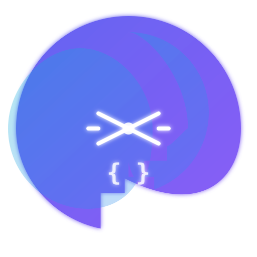
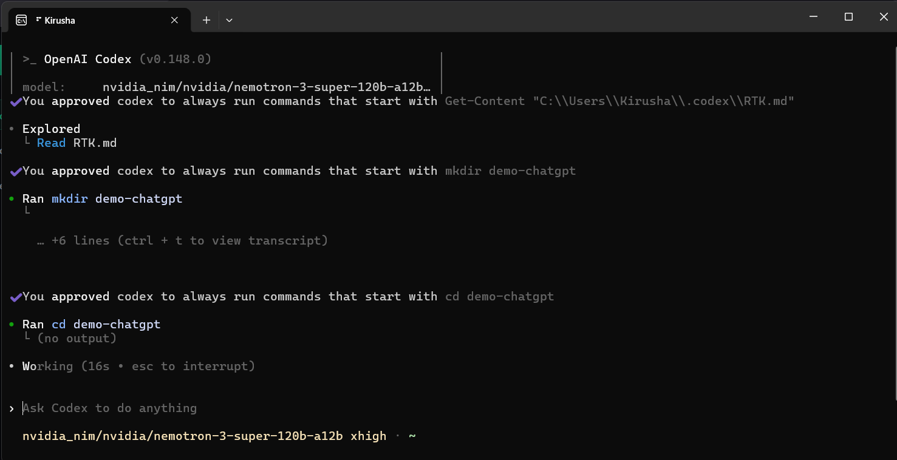
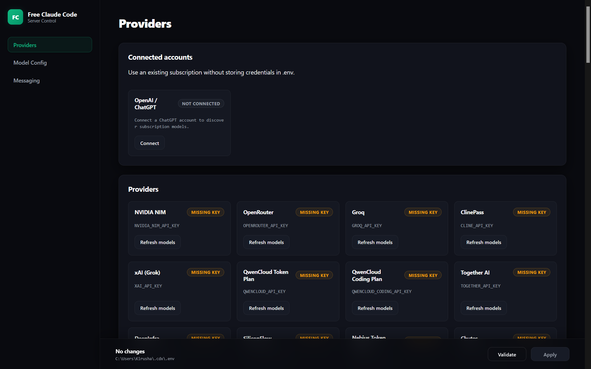

<div align="center">



<h1>
  <picture>
    <source media="(prefers-color-scheme: light)" srcset="assets/codexproxy-wordmark-light.svg">
    
  </picture>
</h1>

[](https://opensource.org/licenses/MIT)
[](https://www.python.org/downloads/)
[](https://github.com/astral-sh/uv)
[](https://github.com/chrometechhype/codexproxy/actions/workflows/tests.yml)
[](https://pypi.org/project/ty/)
[](https://github.com/astral-sh/ruff)
[](https://github.com/Delgan/loguru)

[Quick Start](#quick-start) · [Providers](#choose-a-provider) · [Integrations](#optional-integrations) · [Manage](#manage-your-installation)

</div>

## What You Get

- **48 ToS-friendly providers. 1.3B+ free tokens every month.** Use free, paid, subscription, and local models from one searchable UI without putting your account at risk. CDX follows provider terms and removes integrations if they stop being allowed.
- **1 coding agent. One model catalog.** Run Codex with your CDX models.
- **Up to 90% fewer terminal-output tokens.** Optional [RTK](https://github.com/rtk-ai/rtk) filters common command output, while five CDX optimizations handle quota probes, command-prefix detection, titles, suggestions, and filepaths without calling a provider.
- **Terminal, desktop, IDE, or phone.** Work through native launchers, VS Code, Codex App, JetBrains, Discord, or Telegram.
- **Voice notes in. Code out.** Talk to your agent using local Whisper or NVIDIA NIM transcription.
- **Agent capabilities stay intact.** Stream responses, use tools, preserve native interleaved thinking for maximum performance, send images, and route Sonnet and Haiku independently with compatible models.

Free-tier availability and limits are controlled by each provider and may change.

<div align="center">
  
  <p><em>Codex CLI running through the CodexProxy proxy.</em></p>
</div>

## Quick Start

<a id="install"></a>

### 1. Install Or Update

macOS/Linux:

```bash
curl -fsSL "https://raw.githubusercontent.com/chrometechhype/codexproxy/refs/heads/main/scripts/install.sh" | sh
```

Windows PowerShell:

```powershell
& ([scriptblock]::Create((irm "https://raw.githubusercontent.com/chrometechhype/codexproxy/refs/heads/main/scripts/install.ps1")))
```

Re-run the same command to update. When prompted, choose at least one coding agent and optionally RTK. You can review the installers before running them: [install.sh](scripts/install.sh) and [install.ps1](scripts/install.ps1).

### 2. Start CDX

#### Windows

Open **CodexProxy** from your desktop or Start menu.

#### macOS

Open **CodexProxy** from your desktop or Applications folder.

#### Linux

Run:

```bash
cdx-server
```

CDX opens the Admin UI after starting. On Windows and macOS, use the tray or
menu-bar icon to open Admin, restart, or quit. When using `cdx-server`, keep its
terminal open.

<a id="nvidia-nim-provider"></a>

### 3. Configure NVIDIA NIM

1. Create an API key at [build.nvidia.com/settings/api-keys](https://build.nvidia.com/settings/api-keys).
2. Open the Admin UI URL from the server log.
3. Paste the key into `NVIDIA_NIM_API_KEY`.
4. Leave `MODEL` on the default `nvidia_nim/nvidia/nemotron-3-super-120b-a12b`, or search the model dropdown and select another model.
5. Click **Validate**, then **Apply**.

To protect the local proxy with a bearer token, enable **Proxy Authentication**
in Admin.

<div align="center">
  
</div>

### 4. Run Your Coding Agent

Codex:

```bash
cdx-codex
```

Codex uses the current Admin UI settings. Use the agent's model picker to choose from the models CDX exposes. Normal CLI arguments still work, for example:

```bash
cdx-codex exec "hello"
```

CDX launchers leave your existing agent settings, sessions, credentials, and
extensions unchanged.

## Choose A Provider

1. Open a provider link below for its key, models, or setup instructions.
2. In the Admin UI, configure the listed setting. For OpenAI, use
   **Providers → Connected accounts** instead.
3. Search the `MODEL` dropdown and select a model. If the provider cannot list
   models, enter `<provider-id>/<exact-provider-model-id>` manually.
4. Click **Validate**, then **Apply**.

<details>
<summary><strong>Provider catalog</strong></summary>

| Provider | Admin UI setting | Example `MODEL` |
| --- | --- | --- |
| [NVIDIA NIM](https://build.nvidia.com/settings/api-keys) | `NVIDIA_NIM_API_KEY` | `nvidia_nim/nvidia/nemotron-3-super-120b-a12b` |
| [OpenRouter](https://openrouter.ai/keys) | `OPENROUTER_API_KEY` | `open_router/openrouter/free` |
| [Groq](https://console.groq.com/keys) | `GROQ_API_KEY` | `groq/llama-3.3-70b-versatile` |
| [OpenAI / ChatGPT](https://learn.chatgpt.com/docs/auth) | Connect ChatGPT in the Admin UI | `openai/<model-id>` |
| [xAI (Grok)](https://console.x.ai/team/default/api-keys) | `XAI_API_KEY` | `xai/grok-4.5` |
| [QwenCloud Token Plan](https://home.qwencloud.com/api-keys) | `QWENCLOUD_API_KEY` | `qwencloud/qwen3.7-plus` |
| [QwenCloud Coding Plan](https://home.qwencloud.com/api-keys) | `QWENCLOUD_CODING_API_KEY` | `qwencloud_coding/qwen3.7-plus` |
| [Together AI](https://api.together.ai/settings/api-keys) | `TOGETHER_API_KEY` | `together/zai-org/GLM-5.2` |
| [DeepInfra](https://deepinfra.com/dash/api_keys) | `DEEPINFRA_API_KEY` | `deepinfra/deepseek-ai/DeepSeek-V4-Flash` |
| [SiliconFlow](https://cloud.siliconflow.com/account/ak) | `SILICONFLOW_API_KEY` | `siliconflow/Qwen/Qwen3-32B` |
| [Nebius Token Factory](https://tokenfactory.nebius.com/project/api-keys) | `NEBIUS_API_KEY` | `nebius/Qwen/Qwen3-30B-A3B` |
| [Chutes](https://chutes.ai/docs/getting-started/authentication) | `CHUTES_API_KEY` | `chutes/Qwen/Qwen3-32B-TEE` |
| [Featherless AI](https://featherless.ai/account/api-keys) | `FEATHERLESS_API_KEY` | `featherless/Qwen/Qwen3-32B` |
| [Agnes AI](https://agnes-ai.com/) | `AGNES_API_KEY` | `agnes/agnes-2.0-flash` |
| [ZenMux](https://zenmux.ai/platform/pay-as-you-go) | `ZENMUX_API_KEY` | `zenmux/deepseek/deepseek-v4-flash-free` |
| [W&B Inference](https://wandb.ai/settings) | `WANDB_API_KEY` | `wandb/openai/gpt-oss-20b` |
| [Azure OpenAI](https://learn.microsoft.com/azure/foundry/openai/how-to/chatgpt) | `AZURE_OPENAI_API_KEY` and `AZURE_OPENAI_BASE_URL` | `azure_openai/<deployment-name>` |
| [Google AI Studio (Gemini)](https://aistudio.google.com/apikey) | `GEMINI_API_KEY` | `gemini/models/gemini-3.1-flash-lite` |
| [Google Vertex AI](https://cloud.google.com/vertex-ai/generative-ai/docs/start/openai) | `VERTEX_PROJECT_ID` + ADC | `vertex/google/gemini-3.5-flash` |
| [DeepSeek](https://platform.deepseek.com/api_keys) | `DEEPSEEK_API_KEY` | `deepseek/deepseek-chat` |
| [Mistral La Plateforme](https://console.mistral.ai/) | `MISTRAL_API_KEY` | `mistral/devstral-small-latest` |
| [Mistral Codestral](https://console.mistral.ai/) | `CODESTRAL_API_KEY` | `mistral_codestral/codestral-latest` |
| [Vercel AI Gateway](https://vercel.com/docs/ai-gateway/models-and-providers) | `AI_GATEWAY_API_KEY` | `vercel/openai/gpt-5.5` |
| [Amazon Bedrock](https://console.aws.amazon.com/bedrock/) | `AWS_BEARER_TOKEN_BEDROCK` | `bedrock/openai.gpt-oss-120b` |
| [Hugging Face Inference Providers](https://huggingface.co/settings/tokens) | `HUGGINGFACE_API_KEY` | `huggingface/Qwen/Qwen3-Coder-480B-A35B-Instruct:fastest` |
| [Cohere](https://dashboard.cohere.com/api-keys) | `COHERE_API_KEY` | `cohere/command-a-plus-05-2026` |
| [GitHub Models](https://github.com/marketplace?type=models) | `GITHUB_MODELS_TOKEN` | `github_models/openai/gpt-4.1` |
| [Wafer](https://wafer.ai/) | `WAFER_API_KEY` | `wafer/DeepSeek-V4-Pro` |
| [Kimi API](https://platform.moonshot.ai/console/api-keys) | `KIMI_API_KEY` | `kimi/kimi-k2.5` |
| [Kimi Code](https://www.kimi.com/code/console) | `KIMI_CODE_API_KEY` | `kimi_code/k3` |
| [MiniMax](https://platform.minimax.io/user-center/basic-information/interface-key) | `MINIMAX_API_KEY` | `minimax/MiniMax-M3` |
| [Cerebras Inference](https://cloud.cerebras.ai/) | `CEREBRAS_API_KEY` | `cerebras/gpt-oss-120b` |
| [SambaNova](https://cloud.sambanova.ai/apis) | `SAMBANOVA_API_KEY` | `sambanova/Meta-Llama-3.3-70B-Instruct` |
| [Kilo.ai](https://kilo.ai) | `KILO_API_KEY` | `kilo/kilo-auto/free` |
| [Fireworks AI](https://fireworks.ai/account/api-keys) | `FIREWORKS_API_KEY` | `fireworks/accounts/fireworks/models/llama-v3p3-70b-instruct` |
| [Novita AI](https://novita.ai/settings/key-management) | `NOVITA_API_KEY` | `novita/deepseek/deepseek-v4-flash-0731` |
| [Cloudflare Workers AI](https://developers.cloudflare.com/workers-ai/) | `CLOUDFLARE_API_TOKEN` and `CLOUDFLARE_ACCOUNT_ID` | `cloudflare/@cf/moonshotai/kimi-k2.6` |
| [Z.ai Coding Plan](https://z.ai/manage-apikey/apikey-list) | `ZAI_API_KEY` | `zai/glm-5.2` |
| [Z.ai API (pay as you go)](https://z.ai/manage-apikey/apikey-list) | `ZAI_API_KEY` | `zai_api/glm-4.7-flash` |
| [TokenRouter](https://www.tokenrouter.com/) | `TOKENROUTER_API_KEY` | `tokenrouter/moonshotai/kimi-k3-free` |
| [NaraRoute](https://router.bynara.id/) | `NARAROUTE_API_KEY` | `nararoute/kimi-k3-free` |
| [Ollama Cloud](https://ollama.com/settings/keys) | `OLLAMA_API_KEY` | `ollama_cloud/qwen3-coder:480b` |
| [LM Studio](https://lmstudio.ai/) | `LM_STUDIO_BASE_URL` | `lmstudio/<model-id>` |
| [llama.cpp](https://github.com/ggml-org/llama.cpp) | `LLAMACPP_BASE_URL` | `llamacpp/<model-id>` |
| [Ollama](https://ollama.com/) | `OLLAMA_BASE_URL` | `ollama/<model-tag>` |

</details>

<details>
<summary><strong>Provider-specific setup</strong></summary>

- OpenAI uses your ChatGPT subscription rather than an API key. Connect from
  **Providers → Connected accounts** in the Admin UI. Use device code on
  headless systems. Restart an already-running agent after connecting.
- Azure OpenAI uses the deployment names from your resource. Set
  `AZURE_OPENAI_BASE_URL` to its complete v1 endpoint, such as
  `https://YOUR-RESOURCE-NAME.openai.azure.com/openai/v1/`, and select a
  deployment that supports Chat Completions. Enter the deployment name as a
  custom model slug if it does not appear in the model dropdown.
- Mistral Codestral uses a separate key from Mistral La Plateforme.
- Kimi Code subscription keys use `kimi_code/`; Kimi API credit keys use
  `kimi/`. Kimi Code plans are for personal interactive coding-agent use under
  [Kimi's community guidelines](https://www.kimi.com/code/docs/en/kimi-code/community-guidelines.html).
- QwenCloud Coding Plan keys use `qwencloud_coding/`; QwenCloud Token Plan keys
  use `qwencloud/`. The keys and endpoints are not interchangeable. Coding Plan
  is for local, personal, interactive coding-agent use under the
  [Coding Plan terms](https://www.alibabacloud.com/help/en/model-studio/coding-plan).
- For Amazon Bedrock, set `BEDROCK_BASE_URL` to the URL for the same region as
  the API key and select one of the listed models.
- Vertex AI uses Google Application Default Credentials instead of an API key.
  Locally, run `gcloud auth application-default login` once; service-account
  files and attached service accounts also work. Set `VERTEX_PROJECT_ID`, and
  optionally change `VERTEX_LOCATION` from its `global` default.
- Cloudflare requires both its API token and account ID.
- For Ollama Cloud, use the exact model IDs shown in the model picker. Local
  Ollama uses the separate `ollama/` prefix.
- Prefer tool-capable models for coding agents. Local models also need enough context for the agent's system prompt and tool definitions.

</details>

<details>
<summary><strong>Local provider setup</strong></summary>

### LM Studio

Start LM Studio's local server, load a tool-capable model, and use the model identifier shown by LM Studio with the `lmstudio/` prefix. The default URL is `http://localhost:1234/v1`.

### llama.cpp

Start `llama-server` with its OpenAI-compatible Chat Completions API and enough context for the model. Use the local model ID with the `llamacpp/` prefix. `LLAMACPP_BASE_URL` defaults to `http://localhost:8080/v1`; CDX accepts either the server root or an explicit `/v1` suffix.

### Ollama

```bash
ollama pull llama3.1
ollama serve
```

Use the tag shown by `ollama list` with the `ollama/` prefix. `OLLAMA_BASE_URL` defaults to `http://localhost:11434`; CDX accepts either the server root or an explicit `/v1` suffix.

</details>

<details>
<summary><strong>Reasoning control</strong></summary>

Open **Admin UI → Model Config → Reasoning** and select the behavior you want.

| Selection | Behavior |
| --- | --- |
| **From client** (default) | Use the effort sent by Codex. If none is sent, keep the provider default. |
| **Off** | Request reasoning to be disabled. |
| **Low**, **Medium**, **High**, **X-High**, or **Max** | Override the client with the selected reasoning level. |
| **Inherit** | Use the root Reasoning selection. |

Providers that do not support a selected control retain their own behavior.

</details>

<a id="optional-integrations"></a>

## Optional Integrations

Configure integrations from **Admin UI → Messaging**, then click **Validate** and **Apply**.

<details>
<summary><strong>Discord bot</strong></summary>

1. Create a bot in the [Discord Developer Portal](https://discord.com/developers/applications).
2. Enable **Message Content Intent** and invite it with read, send,
   message-history, and **Manage Messages** permissions so `/clear` can remove
   user prompts.
3. Set **Messaging Platform** to **discord**.
4. Enter **Discord Bot Token**, **Allowed Discord Channels**, and an absolute **Allowed Directory**.
5. Apply the settings and restart the server if requested.

</details>

<details>
<summary><strong>Telegram bot</strong></summary>

1. Create a bot with [@BotFather](https://t.me/BotFather).
2. Get your numeric user ID from [@userinfobot](https://t.me/userinfobot).
   In groups, grant the bot permission to delete messages.
3. Set **Messaging Platform** to **telegram**.
4. Enter **Telegram Bot Token**, **Allowed Telegram User ID**, and an absolute **Allowed Directory**.
5. Apply the settings and restart the server if requested.

</details>

### Messaging commands

| Usage | Behavior |
| --- | --- |
| `/stats` | Show session state. |
| Standalone `/stop` | Cancel all work. |
| Reply with `/stop` | Cancel only the selected request while other queued requests continue. |
| Standalone `/clear` | Reset all CDX state and remove every tracked message in that chat, including user prompts, voice notes, CDX replies, Telegram's online notice, and the clear command itself. |
| Reply with `/clear` | Delete the selected message and its literal platform reply subtree while preserving its ancestors and siblings. |

<details>
<summary><strong>Voice notes</strong></summary>

Choose the voice backend you want, then re-run the installer with its option.

| Voice backend | macOS/Linux option | Windows option |
| --- | --- | --- |
| NVIDIA NIM transcription | `--voice-nim` | `-VoiceNim` |
| Local Whisper on CPU or CUDA | `--voice-local` | `-VoiceLocal` |
| Both backends | `--voice-all` | `-VoiceAll` |
| Local Whisper with CUDA 13.0 | `--voice-local --torch-backend cu130` | `-VoiceLocal -TorchBackend cu130` |

The examples below install NVIDIA NIM transcription. To use another backend,
replace the final option with the matching one from the table.

macOS/Linux:

```bash
curl -fsSL "https://raw.githubusercontent.com/chrometechhype/codexproxy/main/scripts/install.sh" | sh -s -- --voice-nim
```

Windows PowerShell:

```powershell
& ([scriptblock]::Create((irm "https://raw.githubusercontent.com/chrometechhype/codexproxy/main/scripts/install.ps1"))) -VoiceNim
```

Restart `cdx-server`. In **Admin UI → Messaging → Voice**, enable voice notes, select `cpu`, `cuda`, or `nvidia_nim`, and choose the Whisper model. Local gated models need `HUGGINGFACE_API_KEY`; NVIDIA NIM transcription needs `NVIDIA_NIM_API_KEY`.

</details>

## Manage Your Installation

Run `cdx-server --version` to check the installed version without starting CDX.

### Update

Re-run the matching command from [Install Or Update](#install).

### Uninstall

Stop every running CDX command before uninstalling.

**Removes**

- CodexProxy, including its desktop launcher and commands
- `~/.cdx/`

**Keeps**

- uv and Python
- Codex and RTK
- Shared PATH entries

macOS/Linux:

```bash
curl -fsSL "https://raw.githubusercontent.com/chrometechhype/codexproxy/main/scripts/uninstall.sh" | sh
```

Windows PowerShell:

```powershell
& ([scriptblock]::Create((irm "https://raw.githubusercontent.com/chrometechhype/codexproxy/main/scripts/uninstall.ps1")))
```

## Commands

| Command | Description |
| --- | --- |
| `cdx-server` | Start the proxy |
| `cdx-codex` | Write config + launch Codex CLI |
| `cdx-codex-app` | Launch Codex Desktop App |
| `cdx-codex-config` | Write Codex config only (for Desktop App) |
| `cdx-restore` | Restore pre-CodexProxy configuration |
| `cdx-delete` | Complete removal of all CodexProxy files |
| `cdx-init` | Optional scaffold for advanced setup |
| `cdx-desktop` | Launch the desktop app (tray) |

## Project Links

- [Report bugs or request features](https://github.com/chrometechhype/codexproxy/issues)
- [Architecture and extension guide](ARCHITECTURE.md)
- [Contributing guide](CONTRIBUTING.md)

## License

MIT License. See [LICENSE](LICENSE) for details.